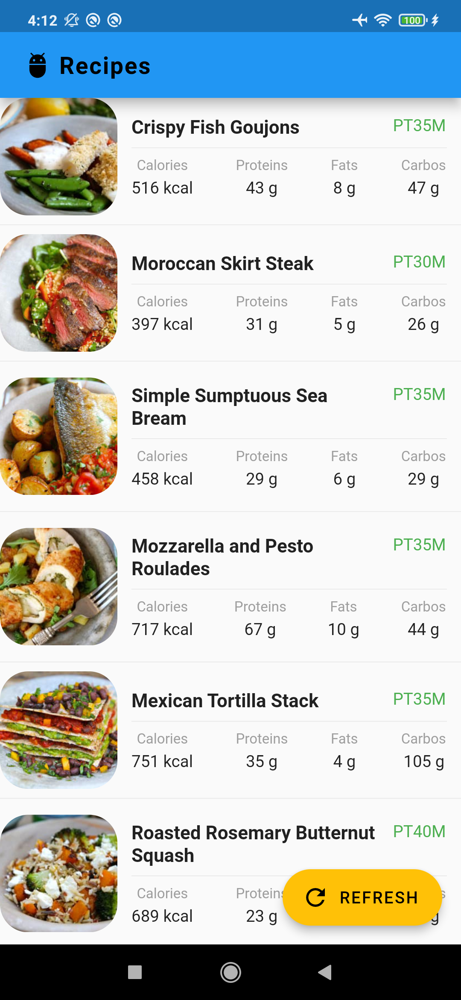
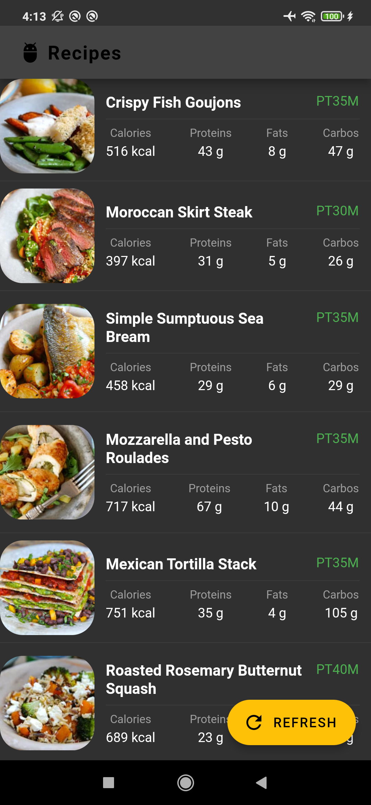
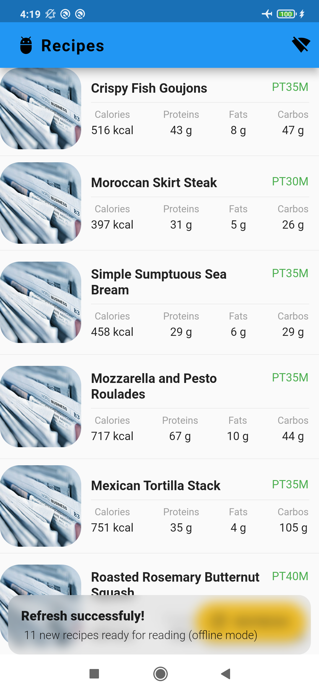

# Clean architecture flutter app

A clean architecture recipes app, made with [Recipes](https://Recipes.org/) and Flutter sdk.

The main goal is to build readble, maintainable, testable, and high-quality flutter app using test-driven-design styled architecture.

You can learn how to implement the architecture here: [TDD Clean Architecture for Flutter](https://medium.com/@fakhiradevina/flutter-tdd-clean-architecture-272373727699)

## Screenshots

   

## Technologies

### Architecture

- **Test-driven-design**
- **Clean architecture**


- Call follow


&nbsp;
&nbsp;

## Real Implementation

===================

To materialize the architectural decisions and to make it more useful to our team, we’ve started to choose flutter packages to suit our needs, following the philosophy of using as fewer third-party packages as possible.

\- To implement _UseCases_ as the Business Logic Components of the application, we felt that the natural decision was the [**_Bloc package_**](https://pub.dev/packages/flutter_bloc), as it is a mature, robust, and well-known solution for state management in _Flutter_ context, and it is easy to test as well.

\- To represent _Bloc_ states and events, _Models_ and _Entities_, we’ve decided to use [**_Freezed package_**](https://pub.dev/packages/freezed), as it is an elegant and easy solution to implement sealed classes, union types and data classes as it is not available by default in _Dart_ (yet!). It’s based in code generation and it has ready-to-use integration with [**_Json\_serializable package_**](https://pub.dev/packages/json_serializable) that we’ve decided to use to deal with serialization.

\- To deal with dependency injection we’ve decided to use a simple service locator: Kiwi, we can replace with [**_GetIt_**](https://pub.dev/packages/get_it) and define a simple set of rules-of-thumb to keep consistency over project’s development and maintenance life cycles. Rules-of-Thumb:

> _— If a class depends on another, it must be passed at instantiation by constructor and the instance control should be made by the service locator._
>
> _— Dependency injection setup for a module/feature should be split in each feature (each feature/module will contain its own file explicitly defining its dependency injection setup)._
>
> _— The service locator should never be referenced in a place other than a constructor call._

\- To deal with internationalization we’ve decided to use pure Object Oriented Programming, and keep all Strings of the application as static constants of an implementation of an abstract class to be defined.

\- To deal with navigation we’ve decided to use the _Flutters_ native _Navigator_, as it poses as a complete solution, and with the arrival of Get Router, we think that it is an elegant declarative solution to deal with navigation. But we can easily switch to flutter navigator following this guide <https://api.flutter.dev/flutter/widgets/Navigator-class.html>, and on production, i prefer using native flutter navigator to navigation and router pages.

\- To deal with http requests we’ve decided to use [**Dio package**](https://pub.dev/packages/dio) as it is a better option than the native _Flutter_ solution presenting good features like Interceptors, base options like headers, base url etc., and is a well known and popular solution. Then we made a wrapper over the client to model errors and responses into our system context.

\- To persist sensitive local data we’ve decided to use the package [**_flutter\_secure\_storage_**](https://pub.dev/packages/flutter_secure_storage) because it is a popular and performative solution when there isn’t the need of storing complex data.

\- To storage data structure with offline mode we've decided to use to hive database and can easily replace with sqflite or sembast are good choice via injection.

\- To multi-language we decided to using flutter localization and i18n packages.

We’ve defined helper classes/types to deal with the Result of actions, the _Result_ type (generic Freezed union type that has two types: a _Success_ and a _Failure_), the _RequestStatus_ type (generic Freezed union type that has four types: _Idle_, _Loading_, _Succeeded_, _Failed_) to help dealing with the visual response of requests, the AppError (abstract class that is implemented in each relevant particular error type), and to help with forms, the _Maybe_ type (generic Freezed union type that has two types: _Nothing_ and _Just_) used in the definition of _FormField_ type (generic Freezed data class containing the name of the field and the Maybe instance representing the actual possible inputted value to the form field).

### Front-end

- **Flutter SDK**
- **GetX (navigation service, dependencies manager, ui components)**
- **Bloc / Cubit / GetX (state managment)**

### Back-end

- **SQLite**
- **Sembast**
- **Hive**
- **Recipes**

## Step to Run App

Make sure you have the latest version of Flutter installed

Open terminal and run this command to generate code:

```flutter packages pub get && flutter pub run build_runner build --delete-conflicting-outputs && flutter gen-l10n```

Step 2: Open folder lib/main.dart and select to run
\

## For testing

1, We have Unit testing all logic at test folder. we can simple execute it via command:

```flutter test --machine --coverage > tests.output```

See more here: <https://docs.flutter.dev/cookbook/testing/unit/introduction>

2, We have integration test at test_driver folder. To run the tests execute following command:

```flutter drive --target=test_driver/app.dart```

See more here: <https://medium.com/@rishabhv1509/flutter-driver-84d54d1d19e6>
